## Advent of Code

https://adventofcode.com

I participated to my first Advent of code in 2023. I loved it so much I decided to do the past editions too. And the next of course.

<!-- AOC TILES BEGIN -->
<h1 align="center">
  Advent of Code - 424/524 ⭐
</h1>
<h1 align="center">
  2025 - 24 ⭐ - Python
</h1>
<a href="2025/day_01.py">
  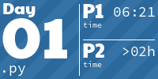
</a>

<a href="2025/day_11.py">
  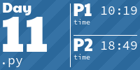
</a>
<a href="2025/day_12.py">
  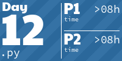
</a>
<h1 align="center">
  2024 - 50 ⭐ - Python
</h1>

<a href="2024/day_11.py">
  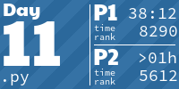
</a>
<a href="2024/day_12.py">
  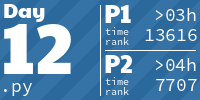
</a>
<a href="2024/day_13.py">
  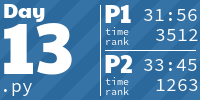
</a>
<a href="2024/day_14.py">
  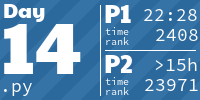
</a>

<a href="2024/day_17.py">
  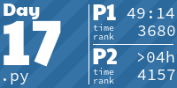
</a>

<a href="2024/day_19.py">
  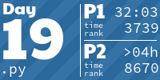
</a>

<a href="2024/day_22.py">
  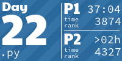
</a>

<a href="2024/day_25.py">
  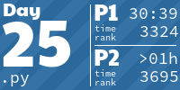
</a>
<h1 align="center">
  2023 - 50 ⭐ - Python
</h1>

<a href="2023/day_11.py">
  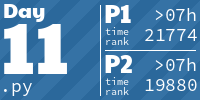
</a>
<a href="2023/day_12.py">
  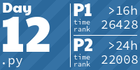
</a>
<a href="2023/day_13.py">
  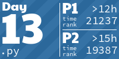
</a>
<a href="2023/day_14.py">
  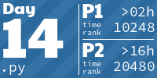
</a>
<a href="2023/day_15.py">
  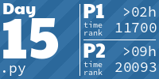
</a>

<a href="2023/day_18.py">
  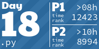
</a>

<a href="2023/day_22.py">
  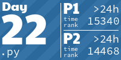
</a>

<h1 align="center">
  2020 - 50 ⭐ - Python
</h1>

<a href="2020/day_11.py">
  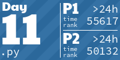
</a>

<a href="2020/day_14.py">
  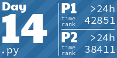
</a>

<a href="2020/day_21.py">
  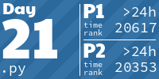
</a>
<a href="2020/day_22.py">
  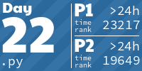
</a>
<a href="2020/day_23.py">
  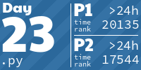
</a>
<a href="2020/day_24.py">
  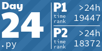
</a>
<a href="2020/day_25.py">
  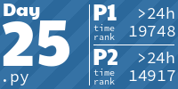
</a>
<h1 align="center">
  2019 - 50 ⭐ - JavaScript
</h1>

<h1 align="center">
  2018 - 50 ⭐ - Python
</h1>

<a href="2018/day_11.py">
  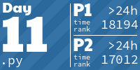
</a>

<a href="2018/day_13.py">
  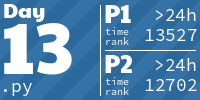
</a>
<a href="2018/day_14.py">
  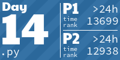
</a>

<a href="2018/day_21.py">
  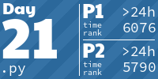
</a>

<a href="2018/day_23.py">
  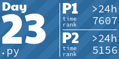
</a>
<a href="2018/day_24.py">
  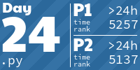
</a>

<h1 align="center">
  2017 - 50 ⭐ - Python
</h1>

<a href="2017/day_11.py">
  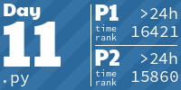
</a>

<a href="2017/day_13.py">
  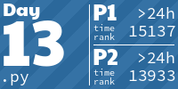
</a>
<a href="2017/day_14.py">
  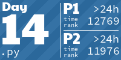
</a>

<a href="2017/day_21.py">
  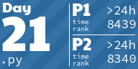
</a>

<a href="2017/day_25.py">
  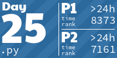
</a>
<h1 align="center">
  2016 - 50 ⭐ - Python
</h1>

<a href="2016/day_11.py">
  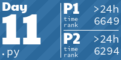
</a>

<a href="2016/day_14.py">
  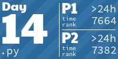
</a>

<a href="2016/day_21.py">
  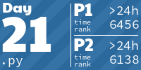
</a>
<a href="2016/day_22.py">
  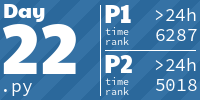
</a>

<a href="2016/day_25.py">
  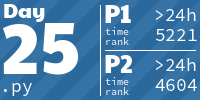
</a>
<h1 align="center">
  2015 - 50 ⭐ - Python
</h1>

<a href="2015/day_11.py">
  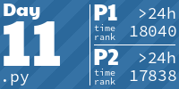
</a>

<a href="2015/day_14.py">
  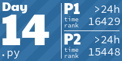
</a>

<a href="2015/day_22.py">
  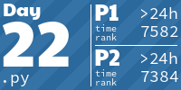
</a>

<!-- AOC TILES END -->

To see code evolution, and comments for each year:

[2023](2023/comments.md) > [2015](2015/comments.md) > [2016](2016/comments.md) > [2017](2017/comments.md) > [2024](2024/comments.md) > [2018](2018/comments.md) > [2019](2019/comments.md) > [2020](2020/comments.md) > [2025](2025/comments.md)

Tiles by [LiquidFun](https://github.com/LiquidFun/aoc_tiles)
