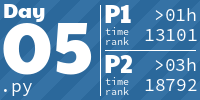

## Ready to find the Chief Historian: https://adventofcode.com/2024

<!-- AOC TILES BEGIN -->
<h1 align="center">
  2024 - 30 ⭐ - Python
</h1>

<!-- AOC TILES END -->

Wanted something clever for day 2 part 2, but went for bruteforce anyway because it's faster (well, for now).

Tried to be ready at 6am for day 3 and 4, but that's too early for me, I'd rather sleep XD.

Again, wanted something clever for day 6 part 2, but I didn't get the correct answer. So I went for pure bruteforce, which took me more than 3minutes (but I got the correct answer). Still, I'm sure something clever should work, so I reworked this. I'm now stuck with a "clever bruteforce": I just narrowed the number of possibilities, so it now takes around 7sec to run. I thought I could change the algorithm but realized there were several configurations that I couldn't anticipate as loops (well, at least I'm not able to do it).

Lost so much time on Day 7 part 1 because I used a dict to store the input, but there were duplicate keys!

I was afraid that it would take forever for Day 8 with permutations, but it runs in no time!

Day 9: like day 7, poor choice of data structure (str instead of list) lead to wrong answer and lots of time wasted! Probably not optimal as part 2 runs in about 5sec, but that will do. Edit: optimised with early breaking, now runs in about a sec.

Day 11: Thought I was clever using a linked list, except that it doesn't make any sense here. A shower later, my thought were in place and used a simple and wey more efficient approach.

Day 14 part 2 was a mess. Tried to look for a global symmetrical pattern, didn't work. Then I looked for a frame, but again, I thought there would be no more noise left, so I didn't get it write. I had an upper bound (by submitting random answers) so I just printed all grids and looked at them... to find a tree after 140k sec, which was too high. But at least, I knew what I was searching for, so it was easier to implement something.

Tiles by [LiquidFun](https://github.com/LiquidFun/aoc_tiles)
