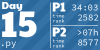
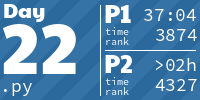
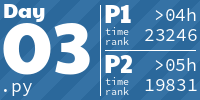
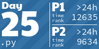
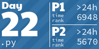
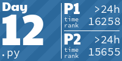
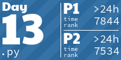
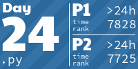

## Advent of Code

https://adventofcode.com

I participated to my first Advent of code in 2023. I loved it so much I decided to do the past editions too. And the next of course.

<!-- AOC TILES BEGIN -->
<h1 align="center">
  Advent of Code - 296/500 ⭐
</h1>
<h1 align="center">
  2024 - 50 ⭐ - Python
</h1>

<h1 align="center">
  2023 - 50 ⭐ - Python
</h1>

<h1 align="center">
  2018 - 46 ⭐ - Python
</h1>

<h1 align="center">
  2017 - 50 ⭐ - Python
</h1>

<h1 align="center">
  2016 - 50 ⭐ - Python
</h1>

<h1 align="center">
  2015 - 50 ⭐ - Python
</h1>

<!-- AOC TILES END -->

Comments for each year:
- [2015](2015/comments.md)
- [2016](2016/comments.md)
- [2017](2017/comments.md)
- [2018](2018/comments.md)
- [2023](2023/comments.md)
- [2024](2024/comments.md)

Tiles by [LiquidFun](https://github.com/LiquidFun/aoc_tiles)
